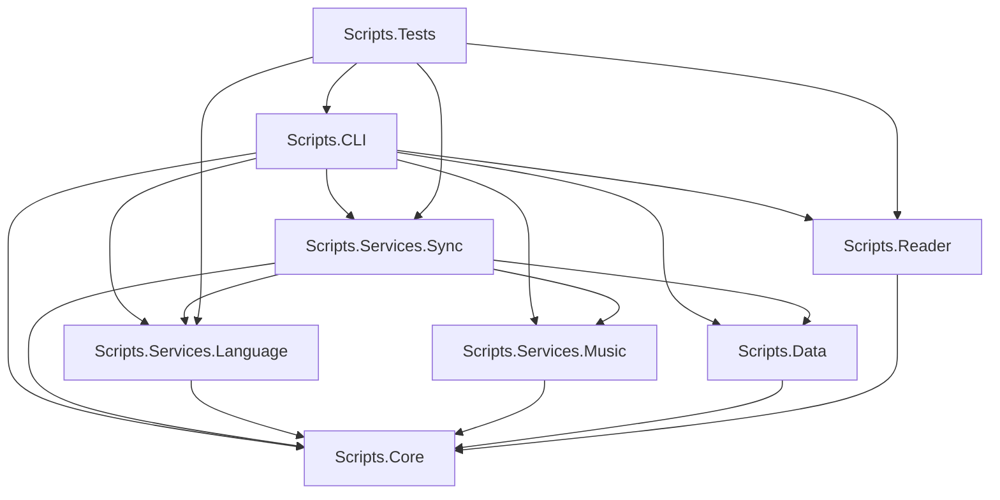

# Design Specification: C# Project Modularization & CPM Migration

## 1. Objective
To restructure the monolithic `csharp` project into a set of highly cohesion-based, concern-specific projects. This will isolate dependencies, reduce compilation scope, speed up build times, and clean up architectural boundaries.

## 2. Architecture & Projects
We will introduce 8 distinct projects to separate concerns:

### Module Definition Table

| Project Name                  | Folder Path                     | Key Concerns & Responsibilities                                                         | NuGet Dependencies                                                                                                                                     |
| :---------------------------- | :------------------------------ | :-------------------------------------------------------------------------------------- | :----------------------------------------------------------------------------------------------------------------------------------------------------- |
| **Scripts.Core**              | `src/Scripts.Core`              | Logging, State persistence, models, resilience, core credentials/Google authentication. | `Serilog` (and sinks), `Polly`, `Polly.RateLimiting`, `Google.Apis.Auth`                                                                               |
| **Scripts.Data**              | `src/Scripts.Data`              | Database entities, EF Core context, configurations.                                     | `Microsoft.EntityFrameworkCore`, `Npgsql.EntityFrameworkCore.PostgreSQL`, `Npgsql`                                                                     |
| **Scripts.Services.Language** | `src/Scripts.Services.Language` | Text translation, LibreTranslate, Lingua language identification.                       | `Azure.AI.Translation.Text`, `RestSharp`, `SearchPioneer.Lingua`                                                                                       |
| **Scripts.Services.Music**    | `src/Scripts.Services.Music`    | MusicBrainz and Discogs metadata lookups.                                               | `MetaBrainz.MusicBrainz`, `ParkSquare.Discogs`                                                                                                         |
| **Scripts.Services.Sync**     | `src/Scripts.Services.Sync`     | Sync engines (Last.fm, YouTube, Google Sheets), orchestrators.                          | `Hqub.Last.fm`, `Google.Apis.Sheets.v4`, `Google.Apis.Drive.v3`, `Google.Apis.YouTube.v3`                                                              |
| **Scripts.Reader**            | `src/Scripts.Reader`            | Browser session, JSTOR extraction, OCR, PDF processing.                                 | `Microsoft.Playwright`, `AngleSharp`, `SmartReader`, `PdfPig`, `Azure.AI.DocumentIntelligence`, `Google.Cloud.Vision.V1`, `Google.Cloud.DocumentAI.V1` |
| **Scripts.CLI**               | `src/Scripts.CLI`               | Command Line Interface, command registrations, console entry.                           | `Spectre.Console`, `Spectre.Console.Cli`                                                                                                               |
| **Scripts.Tests**             | `tests/CSharpScripts.Tests`     | Integration & Unit tests.                                                               | `TUnit`                                                                                                                                                |

---

## 3. Central Package Management (CPM)
We will centralize all NuGet package dependencies using `Directory.Packages.props` in the `csharp/` directory:

- Pin all versions to their stable counterparts currently used in the codebase.
- Enable CPM in `Directory.Build.props` via `<ManagePackageVersionsCentrally>true</ManagePackageVersionsCentrally>`.
- Any new package added to any project will inherit the version declared in the central file, preventing version drift.

---

## 4. Key Fixes & File Cleanups
1. **Accessibility Mismatch (CS0051)**: Change the accessibility of core classes/models (e.g. `StateManager`, `YouTubeVideo`, `FetchState`, `Scrobble`) to `public` to allow clean consumption by other assemblies, or use `InternalsVisibleTo`.
2. **Missing Dependencies**:
   - Add `Google.Apis.Sheets.v4` and `Google.Apis.Drive.v3` to `Scripts.Services.Sync`.
   - Add `SearchPioneer.Lingua` version `1.0.5` to `Scripts.Services.Language`.
3. **Duplicate Cleanups**: Delete/archive `csharp/src/Services/Sync/LastFm/LastFmService.cs` which conflicts with `csharp/src/Services/Sync/LastFmService.cs`.
4. **Offline Language Detection**: Migrate from older NTextCat to `SearchPioneer.Lingua` (v1.0.5), which is completely self-contained and does not require file-based dictionary/profile distribution (removing the need to ship `Core14.profile.xml`).
5. **Polly Resilience usings**: Add missing `using Polly;`, `using Polly.Retry;`, `using System.Net.Sockets;` to `Resilience.cs`.
