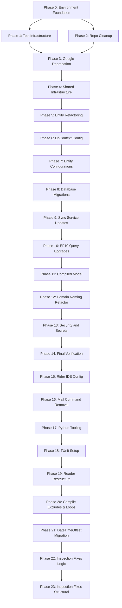

# CPM — Consolidated TDD Plan (SRP Granularity)

> **For agentic workers:** REQUIRED SUB-SKILL: Use superpowers:subagent-driven-development (recommended) or superpowers:
> executing-plans to implement this plan task-by-task. Steps use checkbox (`- [ ]`) syntax for tracking.
>
> **Stack:** C# 14 / .NET 10 / EF Core 10 / Npgsql 10 / PostgreSQL 18 Docker
> **Database:** `pg_db` (credentials in `.env` / `$PGCONNSTR`)
>
> **SRP RULE:** Each task touches exactly ONE property / ONE file / ONE concept. No en-masse edits.
>
> **ABSOLUTE ZERO PRESUMPTION RULESET:**
> 1. **No Tooling Presumptions:** Verify `pwsh`, `dotnet`, and `git` exist before starting.
> 2. **No Success Presumptions:** NEVER use `-ErrorAction SilentlyContinue`. All commands use `-ErrorAction Stop`.
> 3. **No I/O Presumptions:** Every file create/delete/move MUST be followed by a `Test-Path` assertion.
> 4. **No Encoding Presumptions:** Explicitly declare `-Encoding UTF8`.
> 5. **No Exit Code Presumptions:** Capture `2>&1` output and run Regex assertions.
> 6. **No Path Presumptions:** Use absolute paths (`C:\Users\Lance\Dev\Scripts\...`).
> 7. **No State Presumptions:** Log Current State, Reason, What, Expected Outcome before each mutation.
> 8. **No NuGet Presumptions:** Always `dotnet restore` before build/test.
> 9. **No Deletion Presumptions:** Create `.bak.YYYYMMDD_HHmmss` before any deletion.
> 10. **Strict TDD Granularity:** ONE miniscule addition per task.

---

## Plan Phases (0–14)

* **[Phase 0: Environment Foundation](.kilo/plans/plan-phase-0.md)** — Downgrade EF11→EF10, dotnet11→10, docker-compose.yml (credentials via `.env`), baseline restore/build/test.
* **[Phase 1: Test Infrastructure](.kilo/plans/plan-phase-1.md)** — Establish and verify the baseline C# test environment.
* **[Phase 2: Repo Cleanup](.kilo/plans/plan-phase-2.md)** — Assert IDE directories (.vscode and .idea) are clean and absent.
* **[Phase 3: Google Deprecation](.kilo/plans/plan-phase-3.md)** — Verify sheets removal and clear orchestrators of Google dependencies.
* **[Phase 4: Shared Infrastructure](.kilo/plans/plan-phase-4.md)** — Verify diacritic stripping, case normalization, and db registration rules.
* **[Phase 5: Entity Refactoring](.kilo/plans/plan-phase-5.md)** — Remove obsolete metadata and ID properties from domain records.
* **[Phase 6: DbContext Configuration](.kilo/plans/plan-phase-6.md)** — Verify NoTracking, configurations assembly loading, and Videos DbSet.
* **[Phase 7: Entity Configurations](.kilo/plans/plan-phase-7.md)** — Verify index, key, and identity column generation configurations on model builder.
* **[Phase 8: Database Migrations](.kilo/plans/plan-phase-8.md)** — Generate migration, add unaccent/trigram extensions, unique functional indexes, and apply to database.
* **[Phase 9: Sync Service Updates](.kilo/plans/plan-phase-9.md)** — Normalize lookups using ILike, and execute updates/deletes in PostgresService.
* **[Phase 10: EF10 Query Upgrades](.kilo/plans/plan-phase-10.md)** — Implement OrderByDescending().FirstOrDefaultAsync(), Npgsql JSONB containment searches, and fuzzy artist query upgrades.
* **[Phase 11: Optimization — Compiled Model](.kilo/plans/plan-phase-11.md)** — Enable EFOptimizeContext and generate compiled model to speed up startup.
* **[Phase 12: Domain Naming Refactor](.kilo/plans/plan-phase-12.md)** — Rename entities to Entity suffix, rename DTOs, and clean global models import.
* **[Phase 13: Security & Secrets](.kilo/plans/plan-phase-13.md)** — Upgrade Python dependencies, redact secrets, Gitleaks audit.
* **[Phase 14: Final Verification](.kilo/plans/plan-phase-14.md)** — Run final restore, compile, test suite check, and force-push main.
* **[Phase 15: Rider IDE Config](.kilo/plans/plan-phase-15.md)** — Enable SWEA warnings, promote suggestions to warnings, and configure `.editorconfig`.
* **[Phase 16: Mail Command Removal](.kilo/plans/plan-phase-16.md)** — Delete unused Mail CLI stubs and models.
* **[Phase 17: Python Tooling Updates](.kilo/plans/plan-phase-17.md)** — Remove Black references and rely on ruff/ty from pyproject.toml.
* **[Phase 18: TUnit Test Migration](.kilo/plans/plan-phase-18.md)** — Set up TUnit project alongside src/, update `.slnx`, and create a smoke test.
* **[Phase 19: Reader Directory Restructure](.kilo/plans/plan-phase-19.md)** — Organize Reader into Extraction, Local, Output, and Quality subdirectories.
* **[Phase 20: Compile Excludes & Loop Standard](.kilo/plans/plan-phase-20.md)** — Exclude partially-migrated code from csproj and standardize on foreach loops.
* **[Phase 21: DateTimeOffset Migration](.kilo/plans/plan-phase-21.md)** — Migrate Domain to DateTimeOffset, centralize string representation, and JSON DTOs.
* **[Phase 22: Inspection Fixes (Logic)](.kilo/plans/plan-phase-22.md)** — Invert if-statements, remove redundant null-safety, and LINQ conversions.
* **[Phase 23: Inspection Fixes (Structural)](.kilo/plans/plan-phase-23.md)** — Add cancellation tokens, adjust member visibility, suppress uninstantiated classes.

---

## CPM Dependency Flow

---

## The 7-Step TDD CPM Execution Loop

- [ ] **Step 0: Pre-flight Validation, State Capture & Backup**
- [ ] **Step 1: Write the failing test**
- [ ] **Step 2: Read-back Verification (Test File)**
- [ ] **Step 3: Run test to verify it fails (Red Phase)**
- [ ] **Step 3.5: State Assessment & Justification**
- [ ] **Step 4: Write exact implementation**
- [ ] **Step 5: Run test to verify it passes (Green Phase)**
- [ ] **Step 6: Post-state Capture & Commit**

---

## EF Core 10 Feature Reference

| Feature | EF10 Status | Replacement (if unavailable) |
|---------|------------|------------------------------|
| `MaxByAsync` / `MinByAsync` | ❌ EF11 only | `OrderByDescending(x => ...).FirstOrDefaultAsync()` |
| `EF.Functions.JsonPathExists()` | ❌ EF11 only | Npgsql `EF.Functions.JsonContains()` / `@>` operator |
| `EFOptimizeContext` | ✅ EF9-10 only | Removed in EF11 |
| Compiled Models | ✅ Since EF8 | `dotnet ef dbcontext optimize` |
| `EF.Functions.ILike` | ✅ Npgsql 6+ | Available |
| `EF.Functions.TrigramsSimilarity` | ✅ Npgsql 6+ | Available |
| `ExecuteUpdateAsync` / `ExecuteDeleteAsync` | ✅ Since EF7 | Available |
| `DateOnly` translations | ✅ EF10 | Npgsql-native |
| Complex Types (JSON column mapping) | ✅ EF10 | Available |

---

## Connection String Standard

All connection strings are set via the `PGCONNSTR` environment variable (defined in `.env`).
Run `$env:PGCONNSTR` before EF Core commands, or source `.env` in your shell profile.
The Docker MCP database profile URL is defined in `.env` as `DOCKER_MCP_DB_URL`.
