# Music Schema — Final ER Diagram

**Status**: Draft  
**Purpose**: Comprehensive Mermaid ER diagram for all music (pop + classical), with nullable demarcation and rationale.

---

## 1. SQL Terms Glossary (ELI5)

| Term | Plain English | Example |
|------|---------------|---------|
| **PK** (Primary Key) | A unique identifier for each row. No two rows can share the same PK. Cannot be NULL. | `Artist.Id` — each artist has a unique number |
| **FK** (Foreign Key) | A pointer to another table's PK. Establishes a relationship. CAN be NULL (meaning "no relationship"). | `Track.ArtistId` — points to `Artist.Id`. NULL = "artist unknown" |
| **NOT NULL** | A rule that says a column MUST have a value. Cannot be empty. | `Track.Name` — every track must have a name |
| **NULLABLE** (NULL allowed) | A column that CAN be empty/unknown. No value required. | `Track.AlbumId` — track might not belong to any album |
| **RESTRICT** | A safety lock: blocks deletion of a parent row if children still reference it. | Can't delete `Artist` while `Track` rows point to it |
| **Cascade Purge** | Our custom cleanup: delete orphaned children AFTER sync completes. NOT a DB constraint. | After sync: delete tracks with 0 scrobbles → then albums → then artists |
| **Unique Constraint** | A rule that says no two rows can share the same value in this column. | `Artist.Name` — no duplicate artist names |
| **Index** | A performance booster: speeds up searches on specific columns. | `idx_tracks_artist_id` — fast lookup of all tracks by artist |
| **Trigram Index** | A special index for fuzzy text matching. Enables "sounds like" searches. | Search "beatl" finds "Beatles" |

---

## 2. Mermaid ER Diagram — Music Schema

```mermaid
erDiagram
    %% ============================================================
    %% MUSIC SCHEMA — Pop + Classical (Universal Works Table)
    %% ============================================================
    %% 
    %% LEGEND:
    %%   PK = Primary Key (unique row identifier, NOT NULL)
    %%   FK = Foreign Key (pointer to another table's PK, CAN be NULL)
    %%   UK = Unique Constraint (no duplicates allowed)
    %%   
    %%   Relationship Notation:
    %%   ||--o{ = One (mandatory) to Zero-or-Many (optional)
    %%   ||--|{ = One (mandatory) to One-or-Many (required)
    %%   o|--o{ = Zero-or-One (optional) to Zero-or-Many (optional)
    %%   
    %%   NULLABLE columns marked with "?" suffix
    %%   NOT NULL columns have no suffix
    %% ============================================================

    %% ====================
    %% CORE ENTITIES
    %% ====================

    ARTISTS {
        int Id PK "Auto-generated unique ID"
        string Name UK "NOT NULL — Artist name (e.g., 'Beatles', 'Chopin')"
        string NameLower "NOT NULL — Lowercase for case-insensitive search"
        string ExternalId "NULLABLE — Last.fm artist MBID"
        string SourceSystem "NULLABLE — 'lastfm', 'musicbrainz', etc."
        jsonb Metadata "NULLABLE — Raw API response (Pure NULL design)"
        timestamp CreatedAt "NOT NULL — When record was created"
        timestamp UpdatedAt "NOT NULL — When record was last updated"
    }

    ALBUMS {
        int Id PK "Auto-generated unique ID"
        string Name UK "NOT NULL — Album name (e.g., 'Abbey Road')"
        string NameLower "NOT NULL — Lowercase for case-insensitive search"
        string ExternalId "NULLABLE — Last.fm album MBID"
        string SourceSystem "NULLABLE — 'lastfm', 'musicbrainz', etc."
        jsonb Metadata "NULLABLE — Raw API response (Pure NULL design)"
        timestamp CreatedAt "NOT NULL — When record was created"
        timestamp UpdatedAt "NOT NULL — When record was last updated"
    }

    WORKS {
        int Id PK "Auto-generated unique ID"
        string Name "NOT NULL — Work name (e.g., 'Symphony No. 5', 'Yesterday')"
        string NameLower "NOT NULL — Lowercase for case-insensitive search"
        string Composer "NULLABLE — Composer name (e.g., 'Beethoven', 'Lennon/McCartney')"
        string ComposerLower "NULLABLE — Lowercase for case-insensitive search"
        string CatalogueNumber "NULLABLE — Köchel, Opus, BWV (e.g., 'K. 525', 'Op. 67')"
        string KeySignature "NULLABLE — Musical key (e.g., 'C minor', 'G major')"
        string ExternalId "NULLABLE — MusicBrainz Work MBID"
        string SourceSystem "NULLABLE — 'musicbrainz', 'lastfm', etc."
        jsonb Metadata "NULLABLE — Raw API response (Pure NULL design)"
        timestamp CreatedAt "NOT NULL — When record was created"
        timestamp UpdatedAt "NOT NULL — When record was last updated"
    }

    TRACKS {
        int Id PK "Auto-generated unique ID"
        string Name "NOT NULL — Track name (e.g., 'Let It Be', 'Moonlight Sonata')"
        string NameLower "NOT NULL — Lowercase for case-insensitive search"
        int DurationMs "NOT NULL — Duration in milliseconds (NEVER NULL)"
        int ArtistId FK "NULLABLE — Points to ARTISTS.Id. NULL = artist unknown"
        int AlbumId FK "NULLABLE — Points to ALBUMS.Id. NULL = album unknown"
        int WorkId FK "NULLABLE — Points to WORKS.Id. NULL = not linked to a work"
        int MovementId FK "NULLABLE — Points to MOVEMENTS.Id. NULL = whole work (not a movement)"
        string ExternalId "NULLABLE — Last.fm track MBID"
        string SourceSystem "NULLABLE — 'lastfm', 'musicbrainz', etc."
        jsonb Metadata "NULLABLE — Raw API response (Pure NULL design)"
        timestamp CreatedAt "NOT NULL — When record was created"
        timestamp UpdatedAt "NOT NULL — When record was last updated"
    }

    SCROBBLES {
        int Id PK "Auto-generated unique ID"
        int TrackId FK "NOT NULL — Points to TRACKS.Id (scrobble MUST have a track)"
        timestamp ScrobbleDate "NOT NULL — When the track was played (UTC)"
        timestamp ScrobbleDateLocal "NULLABLE — Local time for display (IST)"
        string ExternalId "NULLABLE — Last.fm scrobble timestamp"
        string SourceSystem "NULLABLE — 'lastfm', 'pano', etc."
        jsonb Metadata "NULLABLE — Raw API response (Pure NULL design)"
        timestamp CreatedAt "NOT NULL — When record was created"
    }

    %% ====================
    %% CLASSICAL ENTITIES
    %% ====================

    MOVEMENTS {
        int Id PK "Auto-generated unique ID"
        int WorkId FK "NOT NULL — Points to WORKS.Id (movement belongs to a work)"
        int Position "NOT NULL — Order in work (1, 2, 3...)"
        string Name "NULLABLE — Movement name (e.g., 'Allegro', 'Adagio')"
        string NameLower "NULLABLE — Lowercase for case-insensitive search"
        timestamp CreatedAt "NOT NULL — When record was created"
        timestamp UpdatedAt "NOT NULL — When record was last updated"
    }

    RECORDINGS {
        int Id PK "Auto-generated unique ID"
        int WorkId FK "NOT NULL — Points to WORKS.Id (recording is of a work)"
        string RecordingDate "NULLABLE — When recorded (e.g., '1962', '1995-03-15')"
        string Medium "NULLABLE — Recording medium (e.g., 'Studio', 'Live', 'Vinyl')"
        string ExternalId "NULLABLE — MusicBrainz Recording MBID"
        string SourceSystem "NULLABLE — 'musicbrainz', 'lastfm', etc."
        jsonb Metadata "NULLABLE — Raw API response (Pure NULL design)"
        timestamp CreatedAt "NOT NULL — When record was created"
        timestamp UpdatedAt "NOT NULL — When record was last updated"
    }

    PERFORMERS {
        int Id PK "Auto-generated unique ID"
        string Name UK "NOT NULL — Performer name (e.g., 'Karajan', 'Vienna Philharmonic')"
        string NameLower "NOT NULL — Lowercase for case-insensitive search"
        string Type "NULLABLE — 'Conductor', 'Orchestra', 'Soloist', 'Ensemble'"
        string ExternalId "NULLABLE — MusicBrainz Artist MBID"
        string SourceSystem "NULLABLE — 'musicbrainz', 'lastfm', etc."
        jsonb Metadata "NULLABLE — Raw API response (Pure NULL design)"
        timestamp CreatedAt "NOT NULL — When record was created"
        timestamp UpdatedAt "NOT NULL — When record was last updated"
    }

    RECORDING_PERFORMERS {
        int RecordingId PK, FK "NOT NULL — Points to RECORDINGS.Id"
        int PerformerId PK, FK "NOT NULL — Points to PERFORMERS.Id"
        string Role "NULLABLE — 'Conductor', 'Piano', 'First Violin', etc."
        timestamp CreatedAt "NOT NULL — When record was created"
    }

    %% ====================
    %% CROSS-DOMAIN MAPPING
    %% ====================

    SCROBBLE_CLASSICAL_MAP {
        int ScrobbleId PK, FK "NOT NULL — Points to SCROBBLES.Id"
        int RecordingId FK "NULLABLE — Points to RECORDINGS.Id. NULL = no classical match"
        int WorkId FK "NULLABLE — Points to WORKS.Id. NULL = no classical match"
        float Confidence "NOT NULL — Match confidence (0.0 - 1.0)"
        string MatchMethod "NULLABLE — 'fingerprint', 'metadata', 'manual'"
        timestamp CreatedAt "NOT NULL — When record was created"
    }

    %% ====================
    %% RELATIONSHIPS
    %% ====================

    %% Pop Music Relationships
    ARTISTS ||--o{ TRACKS : "performs"
    ALBUMS ||--o{ TRACKS : "contains"
    TRACKS ||--|{ SCROBBLES : "generates"

    %% Work Relationships (Pop + Classical)
    WORKS ||--o{ TRACKS : "spawns"
    
    %% Classical Relationships
    WORKS ||--|{ MOVEMENTS : "divides into"
    WORKS ||--o{ RECORDINGS : "captured as"
    RECORDINGS ||--o{ RECORDING_PERFORMERS : "features"
    PERFORMERS ||--o{ RECORDING_PERFORMERS : "participates in"

    %% Cross-Domain Mapping
    SCROBBLES ||--o| SCROBBLE_CLASSICAL_MAP : "maps to classical"
    RECORDINGS ||--o| SCROBBLE_CLASSICAL_MAP : "identified from scrobble"
    WORKS ||--o| SCROBBLE_CLASSICAL_MAP : "linked via recording"
```



---

## 3. Nullability Demarcation — Visual Guide

| Column | Nullable? | Rationale |
|--------|-----------|-----------|
| **ARTISTS.Id** | ❌ NOT NULL | PK — must uniquely identify each row |
| **ARTISTS.Name** | ❌ NOT NULL | Every artist must have a name |
| **ARTISTS.ExternalId** | ✅ NULLABLE | Might not have Last.fm MBID (e.g., manual entry) |
| **ARTISTS.Metadata** | ✅ NULLABLE | Pure NULL design — no default `{}` |
| **ALBUMS.Id** | ❌ NOT NULL | PK — must uniquely identify each row |
| **ALBUMS.Name** | ❌ NOT NULL | Every album must have a name |
| **ALBUMS.ExternalId** | ✅ NULLABLE | Might not have Last.fm MBID |
| **ALBUMS.Metadata** | ✅ NULLABLE | Pure NULL design — no default `{}` |
| **WORKS.Id** | ❌ NOT NULL | PK — must uniquely identify each row |
| **WORKS.Name** | ❌ NOT NULL | Every work must have a name |
| **WORKS.Composer** | ✅ NULLABLE | Pop works might not have a composer (e.g., "Yesterday") |
| **WORKS.CatalogueNumber** | ✅ NULLABLE | Only classical works have Köchel/Opus numbers |
| **WORKS.ExternalId** | ✅ NULLABLE | Might not have MusicBrainz MBID |
| **WORKS.Metadata** | ✅ NULLABLE | Pure NULL design — no default `{}` |
| **TRACKS.Id** | ❌ NOT NULL | PK — must uniquely identify each row |
| **TRACKS.Name** | ❌ NOT NULL | Every track must have a name |
| **TRACKS.DurationMs** | ❌ NOT NULL | Track duration is always known (enforced by API) |
| **TRACKS.ArtistId** | ✅ NULLABLE | Artist might be unknown (Pano Scrobbler edge cases) |
| **TRACKS.AlbumId** | ✅ NULLABLE | Album might be unknown (frequent in Last.fm data) |
| **TRACKS.WorkId** | ✅ NULLABLE | Most tracks aren't linked to a formal work |
| **TRACKS.MovementId** | ✅ NULLABLE | NULL = whole work; non-NULL = specific movement |
| **TRACKS.ExternalId** | ✅ NULLABLE | Might not have Last.fm MBID |
| **TRACKS.Metadata** | ✅ NULLABLE | Pure NULL design — no default `{}` |
| **SCROBBLES.Id** | ❌ NOT NULL | PK — must uniquely identify each row |
| **SCROBBLES.TrackId** | ❌ NOT NULL | Every scrobble MUST have a track |
| **SCROBBLES.ScrobbleDate** | ❌ NOT NULL | Scrobble timestamp is always present |
| **SCROBBLES.ScrobbleDateLocal** | ✅ NULLABLE | Might not have local time (edge cases) |
| **SCROBBLES.ExternalId** | ✅ NULLABLE | Might not have Last.fm timestamp |
| **SCROBBLES.Metadata** | ✅ NULLABLE | Pure NULL design — no default `{}` |
| **MOVEMENTS.Id** | ❌ NOT NULL | PK — must uniquely identify each row |
| **MOVEMENTS.WorkId** | ❌ NOT NULL | Every movement belongs to a work |
| **MOVEMENTS.Position** | ❌ NOT NULL | Movement order is always known |
| **MOVEMENTS.Name** | ✅ NULLABLE | Some movements have no name (e.g., "Movement 1") |
| **RECORDINGS.Id** | ❌ NOT NULL | PK — must uniquely identify each row |
| **RECORDINGS.WorkId** | ❌ NOT NULL | Every recording is of a work |
| **RECORDINGS.RecordingDate** | ✅ NULLABLE | Might not know when recorded |
| **RECORDINGS.ExternalId** | ✅ NULLABLE | Might not have MusicBrainz MBID |
| **PERFORMERS.Id** | ❌ NOT NULL | PK — must uniquely identify each row |
| **PERFORMERS.Name** | ❌ NOT NULL | Every performer must have a name |
| **PERFORMERS.Type** | ✅ NULLABLE | Might not know performer type |
| **RECORDING_PERFORMERS.RecordingId** | ❌ NOT NULL | Composite PK — must identify recording |
| **RECORDING_PERFORMERS.PerformerId** | ❌ NOT NULL | Composite PK — must identify performer |
| **RECORDING_PERFORMERS.Role** | ✅ NULLABLE | Might not know specific role |

---

## 4. Data Flow Examples

### Example 1: Pop Music (Beatles — "Let It Be")

```
ARTISTS (Id=1, Name="Beatles")
    ↓ 1:N
ALBUMS (Id=1, Name="Let It Be")
    ↓ 1:N
TRACKS (Id=1, Name="Let It Be", ArtistId=1, AlbumId=1, WorkId=NULL, MovementId=NULL)
    ↓ 1:N
SCROBBLES (Id=1, TrackId=1, ScrobbleDate="2026-06-07T14:30:00Z")
```

**Key Points:**
- `Track.WorkId = NULL` — not linked to a formal "work" (it's a simple pop song)
- `Track.MovementId = NULL` — not a movement (whole track)
- `Track.ArtistId = 1` — linked to Beatles
- `Track.AlbumId = 1` — linked to album

---

### Example 2: Single-Movement Classical (Scriabin — Poem of Ecstasy)

```
ARTISTS (Id=2, Name="Scriabin")
    ↓ 1:N
WORKS (Id=1, Name="Poem of Ecstasy", Composer="Scriabin", CatalogueNumber="Op. 54")
    ↓ 1:N
TRACKS (Id=2, Name="Poem of Ecstasy", ArtistId=2, AlbumId=NULL, WorkId=1, MovementId=NULL)
    ↓ 1:N
SCROBBLES (Id=2, TrackId=2, ScrobbleDate="2026-06-07T15:00:00Z")
```

**Key Points:**
- `Track.WorkId = 1` — linked to formal work
- `Track.MovementId = NULL` — **single-movement work** (no movements table entry)
- `Track.AlbumId = NULL` — might not know album (scrobble data incomplete)
- **No MOVEMENTS row created** — design handles this via nullable MovementId

---

### Example 3: Multi-Movement Classical (Beethoven — Symphony No. 3 "Eroica")

```
ARTISTS (Id=3, Name="Beethoven")
    ↓ 1:N
WORKS (Id=2, Name="Symphony No. 3 'Eroica'", Composer="Beethoven", CatalogueNumber="Op. 55")
    ↓ 1:N
MOVEMENTS [
    (Id=1, WorkId=2, Position=1, Name="Adagio molto - Allegro con brio"),
    (Id=2, WorkId=2, Position=2, Name="Marcia funebre: Adagio assai"),
    (Id=3, WorkId=2, Position=3, Name="Scherzo: Allegro vivace"),
    (Id=4, WorkId=2, Position=4, Name="Finale: Allegro molto")
]
    ↓ 1:N
TRACKS [
    (Id=3, Name="Movement 1", ArtistId=3, WorkId=2, MovementId=1),
    (Id=4, Name="Movement 2", ArtistId=3, WorkId=2, MovementId=2),
    (Id=5, Name="Movement 3", ArtistId=3, WorkId=2, MovementId=3),
    (Id=6, Name="Movement 4", ArtistId=3, WorkId=2, MovementId=4)
]
    ↓ 1:N
SCROBBLES (Id=3, TrackId=3, ScrobbleDate="2026-06-07T16:00:00Z")
```

**Key Points:**
- `Track.WorkId = 2` — linked to formal work
- `Track.MovementId = 1..4` — **multi-movement work** (each track links to specific movement)
- `MOVEMENTS` table has 4 rows — one per movement
- **Movement.Name** can be NULL if movement has no name (rare)

---

## 5. Rationale for Design Choices

### 5.1 Universal Works Table
**Decision**: Single `WORKS` table for ALL music (pop + classical).

**Rationale**:
- Pop songs can be "works" (e.g., "Yesterday" as a composition)
- Classical symphonies are definitely "works"
- Avoids schema pollution (separate tables for pop vs classical works)
- `WORKS.Composer` is NULLABLE — pop works might not have a formal composer
- `WORKS.CatalogueNumber` is NULLABLE — only classical works have Köchel/Opus numbers

### 5.2 Nullable Foreign Keys
**Decision**: `ArtistId`, `AlbumId`, `WorkId`, `MovementId` are all NULLABLE on `TRACKS`.

**Rationale**:
- **ArtistId**: Pano Scrobbler sometimes doesn't report artist (edge cases)
- **AlbumId**: Last.fm frequently returns empty album names (user's data shows this)
- **WorkId**: Most tracks aren't linked to formal works (only classical + some pop)
- **MovementId**: NULL = whole work; non-NULL = specific movement. No fake "Single Movement" rows.

### 5.3 Pure NULL Design (No Defaults)
**Decision**: JSONB fields are NULLABLE with NO default `{}`.

**Rationale**:
- `DEFAULT '{}'::jsonb` contradicts "Pure NULL" philosophy
- NULL = "absence of data" (honest)
- Sentinel `{}` = "a known value that means empty" (fake, pollutes queries)
- C# handles via computed properties: `Metadata?.Property ?? "default"`

### 5.4 Track.DurationMs NOT NULL
**Decision**: Duration is enforced as NOT NULL.

**Rationale**:
- Last.fm API always returns duration for tracks
- If duration is missing, it's a data quality issue (should be flagged)
- Enables reliable "total listening time" calculations

### 5.5 Platform Column Removed
**Decision**: `SCROBBLES.Platform` dropped.

**Rationale**:
- Last.fm API does NOT return source/platform data
- User's Pano Scrobbler data doesn't include platform
- Avoids storing fake/placeholder data

### 5.6 RESTRICT on All FKs
**Decision**: No CASCADE, no soft delete. RESTRICT everywhere.

**Rationale**:
- Blocks accidental deletion of parent while children exist
- Forces explicit cleanup via cascade purge (L1→L2→L3)
- Prevents "oops I deleted an artist and lost all their tracks"

### 5.7 Cascade Purge (L1→L2→L3)
**Decision**: Post-sync cleanup deletes orphaned records in order.

**Rationale**:
- **L1**: Delete tracks with 0 scrobbles (stale data)
- **L2**: Delete albums with 0 tracks (orphaned)
- **L3**: Delete artists with 0 tracks AND 0 albums (fully orphaned)
- Runs in single transaction (all or nothing)
- Prevents accumulation of "dead" records over time

---

## 6. Indexes (Performance Boosters)

```sql
-- Text search indexes (trigram for fuzzy matching)
CREATE INDEX idx_artists_name_lower ON music.artists USING gin(name_lower gin_trgm_ops);
CREATE INDEX idx_albums_name_lower ON music.albums USING gin(name_lower gin_trgm_ops);
CREATE INDEX idx_tracks_name_lower ON music.tracks USING gin(name_lower gin_trgm_ops);
CREATE INDEX idx_works_name_lower ON music.works USING gin(name_lower gin_trgm_ops);
CREATE INDEX idx_works_composer_lower ON music.works USING gin(composer_lower gin_trgm_ops);

-- Foreign key indexes (speed up joins)
CREATE INDEX idx_tracks_artist_id ON music.tracks(artist_id);
CREATE INDEX idx_tracks_album_id ON music.tracks(album_id);
CREATE INDEX idx_tracks_work_id ON music.tracks(work_id);
CREATE INDEX idx_tracks_movement_id ON music.tracks(movement_id);
CREATE INDEX idx_scrobbles_track_id ON music.scrobbles(track_id);
CREATE INDEX idx_movements_work_id ON classical.movements(work_id);
CREATE INDEX idx_recordings_work_id ON classical.recordings(work_id);
CREATE INDEX idx_recording_performers_recording_id ON classical.recording_performers(recording_id);
CREATE INDEX idx_recording_performers_performer_id ON classical.recording_performers(performer_id);

-- Scrobble date index (for date range queries)
CREATE INDEX idx_scrobbles_date ON music.scrobbles(scrobble_date);
```

---

## 7. Next Steps

1. **Update `unified-architecture.md`** with this final ER diagram
2. **Create `EF_REFERENCE.md`** — exhaustive doc explaining every entity, field, type, and relationship
3. **Update `MASTER_PLAN.md`** with all resolved decisions
4. **Generate work plan** in `.omo/plans/*.md`
