# Scripts — Plan Index

> **For agentic workers:** REQUIRED SUB-SKILL: Use `superpowers:subagent-driven-development` (recommended) or `superpowers:executing-plans` to implement tier plans task-by-task.

**Goal:** Migrate monolithic C# project to PostgreSQL (EF Core 10) + 8-project modular solution + hardening.

**Strategy:** Test-Driven Development (TDD) at every step. No production code without a failing test first.

**Execution order is strictly sequential by tier.** Each tier's sign-off gates the next tier.

---

## Tier Overview

| Tier | Directory                   | Phases | Focus                                              | Status  |
| ---- | --------------------------- | ------ | -------------------------------------------------- | ------- |
| T1   | `tier-1-ef-migration/`      | 00–16  | EF Core + PostgreSQL foundation (critical blocker) | ⏳ Ready |
| T2   | `tier-2-cpm-split/`         | 00–10  | CPM + 8-project modular split                      | 🔒 T1   |
| T3   | `tier-3-domain/`            | 00–07  | Domain isolation, naming, DateTimeOffset           | 🔒 T2   |
| T4   | `tier-4-hardening/`         | 00–08  | DI, integration, quality, tooling, security        | 🔒 T3   |

**Total:** 45 sequenced plan files across 4 tiers.

---

## Critical Path (CPM)

```mermaid
flowchart TD
    T1_00[T1-00: Environment Foundation]
    T1_01[T1-01: Entity Extraction]
    T1_02[T1-02: Entity Refactoring]
    T1_03[T1-03: DbContext Config]
    T1_04[T1-04: Entity Configurations]
    T1_05[T1-05: Database Migrations]
    T1_06[T1-06: Repository Pattern]
    T1_07[T1-07: State Manager Migration]
    T1_08[T1-08: Release Cache Migration]
    T1_09[T1-09: Sync Service Updates]
    T1_10[T1-10: EF10 Query Upgrades]
    T1_11[T1-11: Compiled Model]
    T1_12[T1-12: Logging Relocation]
    T1_13[T1-13: Lingua Migration]
    T1_14[T1-14: Resilience Policies]
    T1_15[T1-15: Testcontainers]
    T1_16[T1-16: Sign-off]

    T2_00[T2-00: CPM Foundation]
    T2_01[T2-01: Scripts.Core]
    T2_02[T2-02: Scripts.Data]
    T2_03[T2-03: Scripts.Services.Language]
    T2_04[T2-04: Scripts.Services.Music]
    T2_05[T2-05: Scripts.Orchestrators]
    T2_06[T2-06: Scripts.Reader]
    T2_07[T2-07: Scripts.CLI]
    T2_08[T2-08: Scripts.Tests]
    T2_09[T2-09: Duplicate Cleanup]
    T2_10[T2-10: Sign-off]

    T3_00[T3-00: Reader Domain Isolation]
    T3_01[T3-01: Music Domain Isolation]
    T3_02[T3-02: Language Domain Isolation]
    T3_03[T3-03: Sync Domain Isolation]
    T3_04[T3-04: Naming Refactor]
    T3_05[T3-05: DateTimeOffset Migration]
    T3_06[T3-06: Inspection Fixes Logic]
    T3_07[T3-07: Sign-off]

    T4_00[T4-00: DI Container Wiring]
    T4_01[T4-01: E2E Testing]
    T4_02[T4-02: Inspection Fixes Structural]
    T4_03[T4-03: Reader Directory Restructure]
    T4_04[T4-04: Security Audit]
    T4_05[T4-05: Tooling Cleanup]
    T4_06[T4-06: Documentation]
    T4_07[T4-07: OCI Deployment]
    T4_08[T4-08: Sign-off]

    T1_00 --> T1_01
    T1_01 --> T1_02
    T1_02 --> T1_03
    T1_03 --> T1_04
    T1_04 --> T1_05
    T1_05 --> T1_06
    T1_06 --> T1_07
    T1_07 --> T1_08
    T1_08 --> T1_09
    T1_09 --> T1_10
    T1_10 --> T1_11
    T1_11 --> T1_12
    T1_12 --> T1_13
    T1_13 --> T1_14
    T1_14 --> T1_15
    T1_15 --> T1_16

    T1_16 --> T2_00
    T2_00 --> T2_01
    T2_01 --> T2_02
    T2_02 --> T2_03
    T2_03 --> T2_04
    T2_04 --> T2_05
    T2_05 --> T2_06
    T2_06 --> T2_07
    T2_07 --> T2_08
    T2_08 --> T2_09
    T2_09 --> T2_10

    T2_10 --> T3_00
    T3_00 --> T3_01
    T3_01 --> T3_02
    T3_02 --> T3_03
    T3_03 --> T3_04
    T3_04 --> T3_05
    T3_05 --> T3_06
    T3_06 --> T3_07

    T3_07 --> T4_00
    T4_00 --> T4_01
    T4_01 --> T4_02
    T4_02 --> T4_03
    T4_03 --> T4_04
    T4_04 --> T4_05
    T4_05 --> T4_06
    T4_06 --> T4_07
    T4_07 --> T4_08
```



---

## 7-Step TDD Execution Loop

Every task in every tier plan follows this loop exactly. No shortcuts.

```
Step 0: Pre-flight Validation, State Capture & Backup
Step 1: Write the failing test                          ← RED
Step 2: Read-back Verification (confirm file written)
Step 3: Run test to verify it FAILS                     ← Confirm RED
Step 3.5: State Assessment — why did it fail? Is the failure expected?
Step 4: Write minimal implementation                    ← GREEN
Step 5: Run test to verify it PASSES                    ← Confirm GREEN
Step 6: Post-state Capture & Commit
```

**Iron Law:** `NO PRODUCTION CODE WITHOUT A FAILING TEST FIRST.`
If you wrote code before the test — delete it. Start over.

---

## Absolute Zero Presumption Ruleset

These rules apply to every agent executing any plan in any tier.

1. **No Tooling Presumptions** — Verify `pwsh`, `dotnet`, `git` exist before starting
2. **No Success Presumptions** — Never `-ErrorAction SilentlyContinue`. Always `-ErrorAction Stop`
3. **No I/O Presumptions** — Every file create/delete/move MUST be followed by `Test-Path`
4. **No Encoding Presumptions** — Explicitly `-Encoding UTF8`
5. **No Exit Code Presumptions** — Capture `2>&1`, run Regex assertions
6. **No Path Presumptions** — Absolute paths only: `C:\Users\Lance\Dev\Scripts\...`
7. **No State Presumptions** — Log: State → Reason → What → Expected Outcome before each mutation
8. **No NuGet Presumptions** — `dotnet restore` before every build/test
9. **No Deletion Presumptions** — `.bak.YYYYMMDD_HHmmss` before any deletion
10. **Strict TDD Granularity** — ONE addition per task

---

## TDD Enforcement Checklist (Before Every Commit)

- [ ] Test written before implementation
- [ ] Watched test fail (RED) — confirmed correct failure message
- [ ] Wrote minimal code (GREEN) — no over-engineering
- [ ] Watched test pass
- [ ] Refactored while staying green
- [ ] All pre-existing tests still pass
- [ ] `dotnet build` clean (zero warnings with `TreatWarningsAsErrors`)

---

## Plan File Inventory

### Tier 1 — EF Migration

| File | Phase | Status |
| ---- | ----- | ------ |
| [00-environment.md](tier-1-ef-migration/00-environment.md) | DB connectivity, Docker, env vars | ⏳ |
| [01-entities.md](tier-1-ef-migration/01-entities.md) | Extract EF Core entities from Sheets models | ⏳ |
| [02-entity-refactoring.md](tier-1-ef-migration/02-entity-refactoring.md) | Remove obsolete Mbid/metadata props | ⏳ |
| [03-dbcontext-config.md](tier-1-ef-migration/03-dbcontext-config.md) | NoTracking, config assembly loading | ⏳ |
| [04-entity-configurations.md](tier-1-ef-migration/04-entity-configurations.md) | Indexes, keys, identity columns | ⏳ |
| [05-migrations.md](tier-1-ef-migration/05-migrations.md) | unaccent, trigram, functional indexes | ⏳ |
| [06-repositories.md](tier-1-ef-migration/06-repositories.md) | Repository interfaces + implementations | ⏳ |
| [07-state-manager.md](tier-1-ef-migration/07-state-manager.md) | JSON file state → EF Core + Sheets fallback | ⏳ |
| [08-release-cache.md](tier-1-ef-migration/08-release-cache.md) | CSV cache → EF Core | ⏳ |
| [09-sync-service-updates.md](tier-1-ef-migration/09-sync-service-updates.md) | ILike, ExecuteUpdate/Delete in sync | ⏳ |
| [10-ef10-queries.md](tier-1-ef-migration/10-ef10-queries.md) | Replace EF11-only features with EF10 equivalents | ⏳ |
| [11-compiled-model.md](tier-1-ef-migration/11-compiled-model.md) | EFOptimizeContext compiled model | ⏳ |
| [12-logging.md](tier-1-ef-migration/12-logging.md) | Relocate logs → ~/.cache, CompactJson, Demystifier | ⏳ |
| [13-lingua.md](tier-1-ef-migration/13-lingua.md) | NTextCat → SearchPioneer.Lingua v1.0.5 | ⏳ |
| [14-resilience.md](tier-1-ef-migration/14-resilience.md) | Polly v8 retry + circuit breaker | ⏳ |
| [15-testcontainers.md](tier-1-ef-migration/15-testcontainers.md) | PostgresContainer integration tests | ⏳ |
| [16-sign-off.md](tier-1-ef-migration/16-sign-off.md) | 150+ tests green, full E2E workflow | ⏳ |

### Tier 2 — CPM + Modularization

| File | Phase | Status |
| ---- | ----- | ------ |
| [00-cpm-foundation.md](tier-2-cpm-split/00-cpm-foundation.md) | Directory.Build.props + Directory.Packages.props | 🔒 |
| [01-scripts-core.md](tier-2-cpm-split/01-scripts-core.md) | Extract Scripts.Core project | 🔒 |
| [02-scripts-data.md](tier-2-cpm-split/02-scripts-data.md) | Extract Scripts.Data project | 🔒 |
| [03-scripts-language.md](tier-2-cpm-split/03-scripts-language.md) | Extract Scripts.Services.Language | 🔒 |
| [04-scripts-music.md](tier-2-cpm-split/04-scripts-music.md) | Extract Scripts.Services.Music | 🔒 |
| [05-scripts-orchestrators.md](tier-2-cpm-split/05-scripts-orchestrators.md) | Extract Scripts.Orchestrators | 🔒 |
| [06-scripts-reader.md](tier-2-cpm-split/06-scripts-reader.md) | Extract Scripts.Reader | 🔒 |
| [07-scripts-cli.md](tier-2-cpm-split/07-scripts-cli.md) | Extract Scripts.CLI + Program.cs | 🔒 |
| [08-scripts-tests.md](tier-2-cpm-split/08-scripts-tests.md) | Rename + wire Scripts.Tests | 🔒 |
| [09-duplicate-cleanup.md](tier-2-cpm-split/09-duplicate-cleanup.md) | Delete src/Infrastructure duplicates | 🔒 |
| [10-sign-off.md](tier-2-cpm-split/10-sign-off.md) | Full solution build, 200+ tests green | 🔒 |

### Tier 3 — Domain Isolation

| File | Phase | Status |
| ---- | ----- | ------ |
| [00-reader-domain.md](tier-3-domain/00-reader-domain.md) | Reader isolation audit + standalone test | 🔒 |
| [01-music-domain.md](tier-3-domain/01-music-domain.md) | Music isolation audit | 🔒 |
| [02-language-domain.md](tier-3-domain/02-language-domain.md) | Language isolation audit | 🔒 |
| [03-sync-domain.md](tier-3-domain/03-sync-domain.md) | Sync/Orchestrators isolation audit | 🔒 |
| [04-naming-refactor.md](tier-3-domain/04-naming-refactor.md) | Entity suffix, DTO cleanup, global models | 🔒 |
| [05-datetimeoffset.md](tier-3-domain/05-datetimeoffset.md) | Migrate domain to DateTimeOffset | 🔒 |
| [06-inspection-logic.md](tier-3-domain/06-inspection-logic.md) | Invert ifs, LINQ, redundant null-safety | 🔒 |
| [07-sign-off.md](tier-3-domain/07-sign-off.md) | All domain boundaries verified | 🔒 |

### Tier 4 — Hardening

| File | Phase | Status |
| ---- | ----- | ------ |
| [00-di-wiring.md](tier-4-hardening/00-di-wiring.md) | DI container wiring across all projects | 🔒 |
| [01-e2e-testing.md](tier-4-hardening/01-e2e-testing.md) | End-to-end sync workflow tests | 🔒 |
| [02-inspection-structural.md](tier-4-hardening/02-inspection-structural.md) | CancellationTokens, member visibility | 🔒 |
| [03-reader-restructure.md](tier-4-hardening/03-reader-restructure.md) | Reader subdirs: Extraction/Local/Output/Quality | 🔒 |
| [04-security-audit.md](tier-4-hardening/04-security-audit.md) | Gitleaks, secret redaction, Python deps | 🔒 |
| [05-tooling.md](tier-4-hardening/05-tooling.md) | Rider config, Mail removal, Python ruff/ty | 🔒 |
| [06-documentation.md](tier-4-hardening/06-documentation.md) | Final docs, onboarding guide | 🔒 |
| [07-oci-deployment.md](tier-4-hardening/07-oci-deployment.md) | Migrate DB to OCI Docker + WinSCP config | 🔒 |
| [08-sign-off.md](tier-4-hardening/08-sign-off.md) | Release-ready verification | 🔒 |
