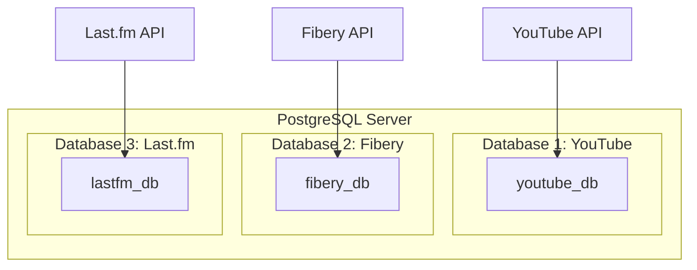
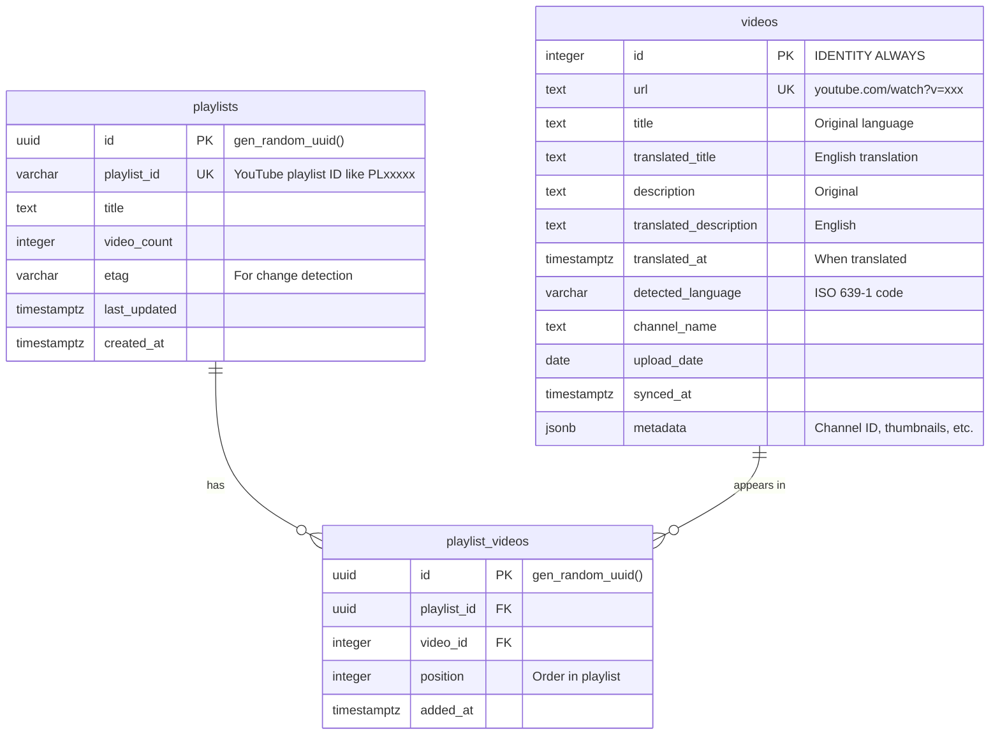
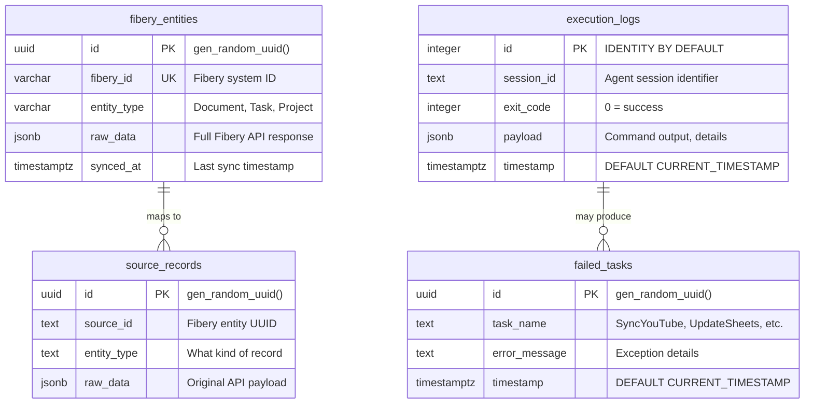
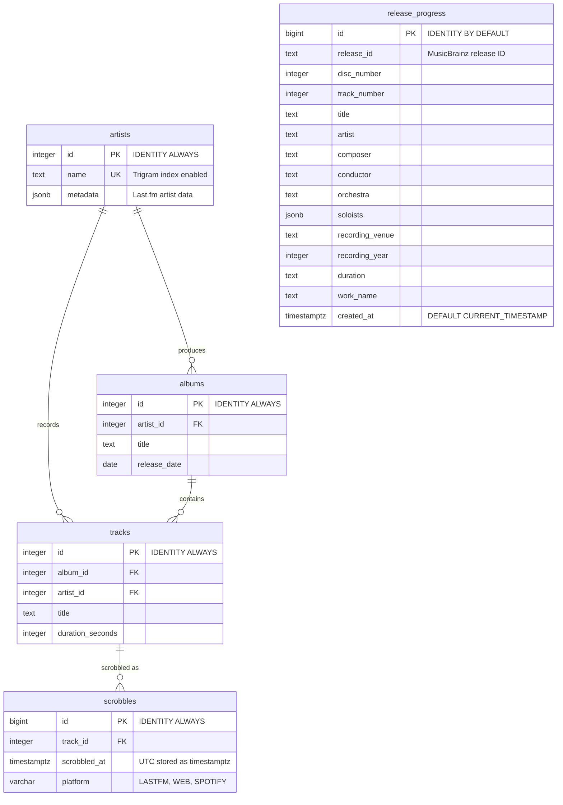
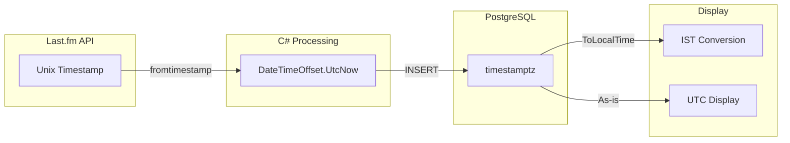

# PostgreSQL Database Schema Mapping

## Overview

Three separate databases for different concerns:



---

## Database 1: YouTube Playlists



### Key Indexes
- `playlists.playlist_id` — UNIQUE
- `videos.url` — UNIQUE
- `playlist_videos(playlist_id, video_id)` — UNIQUE composite
- `videos.title` — GIN trigram for fuzzy search

---

## Database 2: Fibery (Notes & Logs)



### Key Indexes
- `fibery_entities(fibery_id, entity_type)` — UNIQUE composite
- `failed_tasks.task_name` — for filtering by task
- `execution_logs.session_id` — for grouping

---

## Database 3: Last.fm Scrobbles (UTC 24h)



### Key Indexes
- `scrobbles(track_id, scrobbled_at)` — UNIQUE composite
- `tracks(artist_id, title)` — UNIQUE composite
- `albums(artist_id, title)` — UNIQUE composite
- All name/title columns use GIN trigram indexes

---

## UTC Time Handling



**Safety chain:**
1. Last.fm API returns Unix timestamp (always UTC)
2. C# uses `DateTimeOffset` (not `DateTime`) — preserves offset
3. PostgreSQL `timestamptz` stores as UTC internally
4. Display layer calls `.ToLocalTime()` or `.ToIst()` only for presentation
5. Never muddles — `DateTimeKind.Utc` enforced at source

---

## New Fields for YouTube Translation

```sql
-- Migration: Add translation fields to videos table
ALTER TABLE videos
    ADD COLUMN translated_title text,
    ADD COLUMN translated_description text,
    ADD COLUMN translated_at timestamptz,
    ADD COLUMN detected_language varchar(10);

-- Index for finding untranslated videos
CREATE INDEX idx_videos_needs_translation
    ON videos (detected_language)
    WHERE translated_title IS NULL AND detected_language IS NOT NULL;
```

---

## Entity Relationships Summary

| Database | Tables | FK Relationships |
|----------|--------|------------------|
| YouTube | `playlists`, `playlist_videos`, `videos` | playlist_videos → playlists, playlist_videos → videos |
| Fibery | `fibery_entities`, `execution_logs`, `failed_tasks`, `source_records` | failed_tasks ← execution_logs, source_records → fibery_entities |
| Last.fm | `artists`, `albums`, `tracks`, `scrobbles`, `release_progress` | albums → artists, tracks → albums + artists, scrobbles → tracks |
