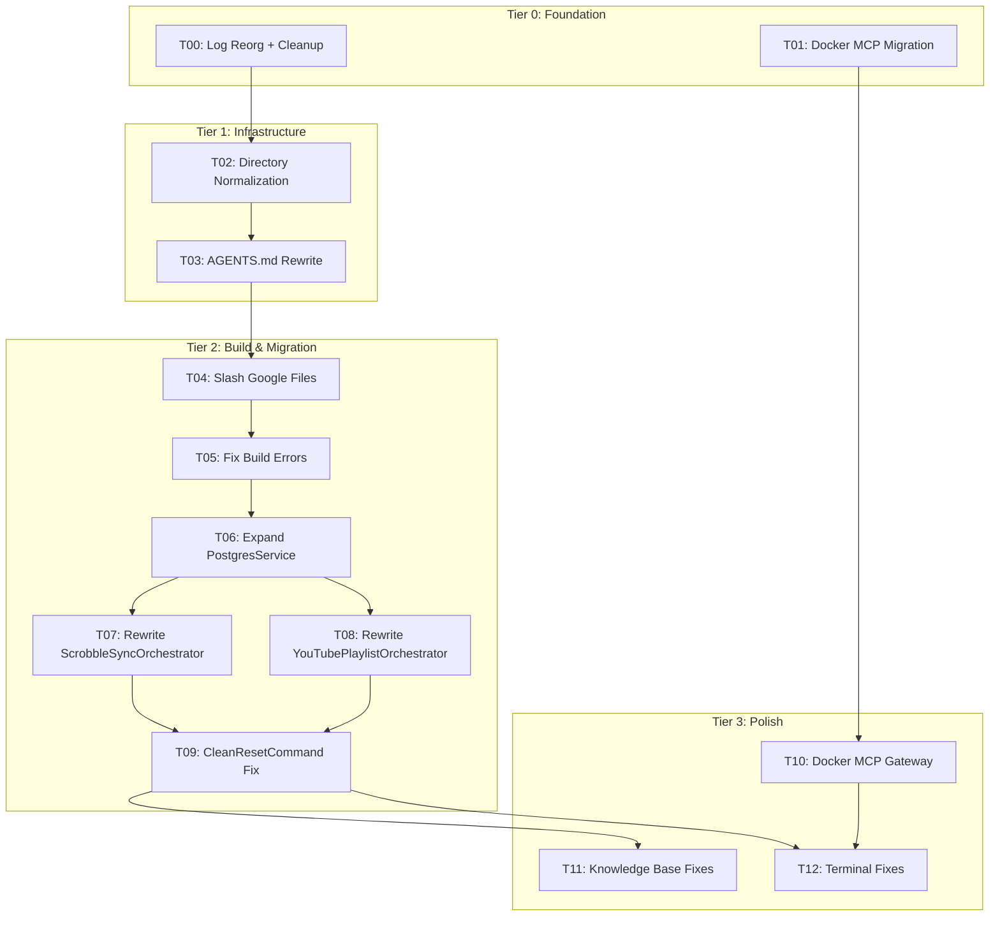

# CPM — Consolidated Plan

> **Single source of task state.** All work tracked here.
> **Base:** `docs/` for plans, research, prompts, knowledge | `.kilo/` for skills, rules, logs
> **Shell:** PowerShell 7 via cmd.exe | **Platform:** Kilo Code

---

## Status Overview

| Gate | Condition                                       | Status |
| ---- | ----------------------------------------------- | :----: |
| G1   | MCP servers operational (SSH, fetch, context7)  |   ✅   |
| G2   | PG schema deployed (7 tables)                   |   ✅   |
| G3   | CSV data ingested (fibery_entities > 0)         |   ✅   |
| G4   | Scrobble sync works (scrobbles > 0)             |   ❌   |
| G5   | Execution logs captured (execution_logs > 0)    |   ✅   |
| G6   | EF Core builds (dotnet build exit 0)            |   ❌   |
| G7   | Neon sync verified                              |   ❌   |
| G8   | Orchestrator clean (0 GoogleSheetsService refs) |   ❌   |

---

## Dependency Graph



---

## Target Directory Structure

```
.kilo/                          # Agent orchestration (skills, rules, runtime logs)
├── skills/Powershell-SKILL.md
├── rules/standards.md
└── logs/                       # Runtime artifacts only

docs/                           # Human documentation & planning
├── plans/cpm.md                # Single source of task state
├── research/                   # Research & analysis
├── prompts/                    # Tiered execution prompts
├── knowledge/                  # Technical reference
│   └── verification/           # Task verification records
└── Fibery Export/              # CSV migration data
```

---

## Tier 0 — Foundation

### T00 — Log Reorganization & Root Cleanup

| Field        | Value            |
| ------------ | ---------------- |
| Status       | DONE             |
| Dependencies | None             |
| Strategy     | Move then delete |

**Actions:**

1. Move all `.kilo/logs/*.md` → `docs/research/`
2. Move `.kilo/plans/cpm.md` → `docs/plans/cpm.md`
3. Move `.kilo/prompt/tier-*.md` + `active-task.md` → `docs/prompts/`
4. Move `.kilo/knowledge/` content → `docs/knowledge/`
5. Move `.kilo/Fibery Export/` → `docs/Fibery Export/`
6. Delete `.vscode/`, `.idea/`, `.playwright-mcp/`, `.clineignore`
7. Delete top-level `docs/csharp-migration-spec.md` (absorbed into research)
8. Delete top-level `logs/` directory (JSONL runtime logs consolidated to `.kilo/logs/`)
9. Remove empty directories from `.kilo/` (keep only skills/, rules/, logs/)

**Verify:** `.kilo/` contains only `skills/`, `rules/`, `logs/`

---

### T01 — Docker MCP Migration

| Field        | Value                        |
| ------------ | ---------------------------- |
| Status       | DONE                         |
| Dependencies | None                         |
| Strategy     | Docker-native MCP management |

**Actions:**

1. Verify Docker Desktop 4.62+ with MCP Toolkit enabled
2. Ensure two distinct profiles: `default` (for general tools) and `database` (for Neon PostgreSQL)
3. Add servers to `default`: fetch, playwright, context7
4. Add `neondatabase/neon-mcp` server to `database`
5. Configure `.gemini/antigravity/mcp_config.json` to point to Docker gateway profiles

**Verify:** `docker mcp profile list` shows both profiles

---

## Tier 1 — Infrastructure

### T02 — Directory Normalization

**Actions:**

1. Delete empty root stubs
2. Delete `consolidation-plan.md` (absorbed)
3. Ensure `.kilo/` is minimal: skills, rules, logs only

### T03 — AGENTS.md Rewrite

**Actions:**

1. Update directory map to reflect new `docs/` + `.kilo/` split
2. Remove `.clinerules/` references
3. Reference `docs/plans/cpm.md` as plan, `docs/prompts/active-task.md` as tracker

---

## Tier 2 — Build & Migration (GSheets → PSQL)

### T04 — Slash Google Files

**Delete:** 6 Google Sheets files + both orchestrators
**Remove:** Google global usings, NuGet packages
**Keep:** YouTube OAuth packages

### T05 — Fix Build Errors

Fix CS1503 (Exception→string), CS0103/CS0246 (missing types), IDE/CA rules

### T06 — Expand PostgresService

Add: UpsertArtist, UpsertAlbum, UpsertTrack, UpsertScrobble (composite key), GetLatestTimestamp, BulkUpsert, YouTube
storage methods

### T07 — Rewrite ScrobbleSyncOrchestrator (~150 lines)

Constructor: `(LastFmService, PostgresService, DateTime?, CancellationToken)`

### T08 — Rewrite YouTubePlaylistOrchestrator (~400 lines)

Constructor: `(YouTubeService, PostgresService, YouTubeChangeDetector, bool, CancellationToken)`

### T09 — CleanResetCommand Fix

Replace Sheets reset with PG truncate/delete

---

## Tier 3 — Polish

### T10 — Docker MCP Gateway & Neon Config

Finalize Docker MCP profile configuration and setup Neon API Key secret for the `database` profile (Delayed for later).

### T11 — Knowledge Base Fixes

Fix architecture.md claims, MCP definitions

### T12 — Terminal Fixes

Fix Rider terminal, profile logging, orphan cleanup

---

## Parallel Groups

| Group | Tasks       |    Ready?     |
| ----- | ----------- | :-----------: |
| A     | T00, T01    |    ✅ Now     |
| B     | T02, T03    |   After T00   |
| C     | T04→T05→T06 |  Sequential   |
| D     | T07, T08    |   After T06   |
| E     | T09         | After T07+T08 |
| F     | T10         |   After T01   |
| F     | T11, T12    |   After T09   |
